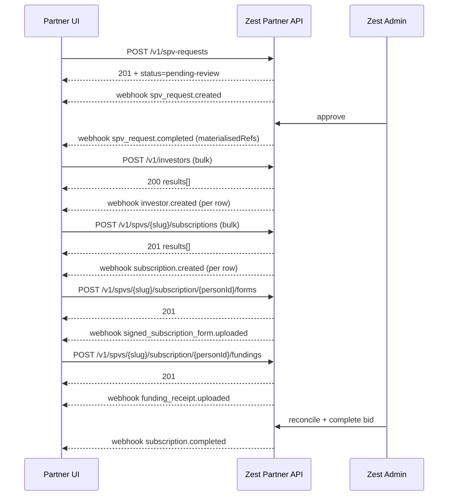

This page walks the canonical happy path for a partner integration. Use it as a checklist when designing your integration's state machine.

## High-level sequence

## Where the partner waits

Two synchronous gates can take significant wall-clock time:

1. **SPV approval.** Between `spv_request.created` and `spv_request.completed` there is human review. Plan your UI to surface "pending review" to your operator and rely on the webhook to advance the flow.
2. **Subscription completion.** Between `funding_receipt.uploaded` and `subscription.completed` Zest reconciles the wire. This is also human-paced.

In both cases, persist your local state machine and react to the corresponding webhook. Don't poll — every webhook delivery uses the [retry schedule](/webhooks/retries) and dedup recipe.

## Where uploads block each other

Within a single subscription:

- Both endpoints accept files up to **10 MB** and only PDF / JPEG / PNG / WEBP.

## Failure handling cheatsheet

| Failure | Where | What to do |
| ------- | ----- | ---------- |
| Network timeout on a `POST` | Synchronous request | Retry with the **same** `Idempotency-Key`. |
| `409 conflict` on `Idempotency-Key` | Synchronous request | Either replay the original body, or generate a fresh key. |
| `400 validation_error` | Synchronous request | Inspect `validationErrors[]`, fix the row, resubmit. |
| `409 conflict` on `fundings` | Synchronous request | Forms haven't been uploaded yet. Upload form first. |
| `5xx` from Zest | Synchronous request | Exponential backoff, cite `errorId` if persistent. |
| Webhook receipt | Async | Verify signature → dedup `eventId` → process. |
| Webhook receipt timeout | Async | Zest re-delivers per the retry schedule; idempotency on your side is mandatory. |

## Suggested data model on the partner side

For each Zest resource you should store, at minimum:

- `spv_request.{slug, status, materialisedRefs}` keyed by your local intent id.
- `investors.{partnerInvestorId, zestPersonId}` mapping table.
- `subscriptions.{subscriptionSlug, partnerSubscriptionId, personId, spvSlug, status}` per investor + SPV.
- `webhook_events.{eventId, eventType, occurredAt}` for dedup + audit.
