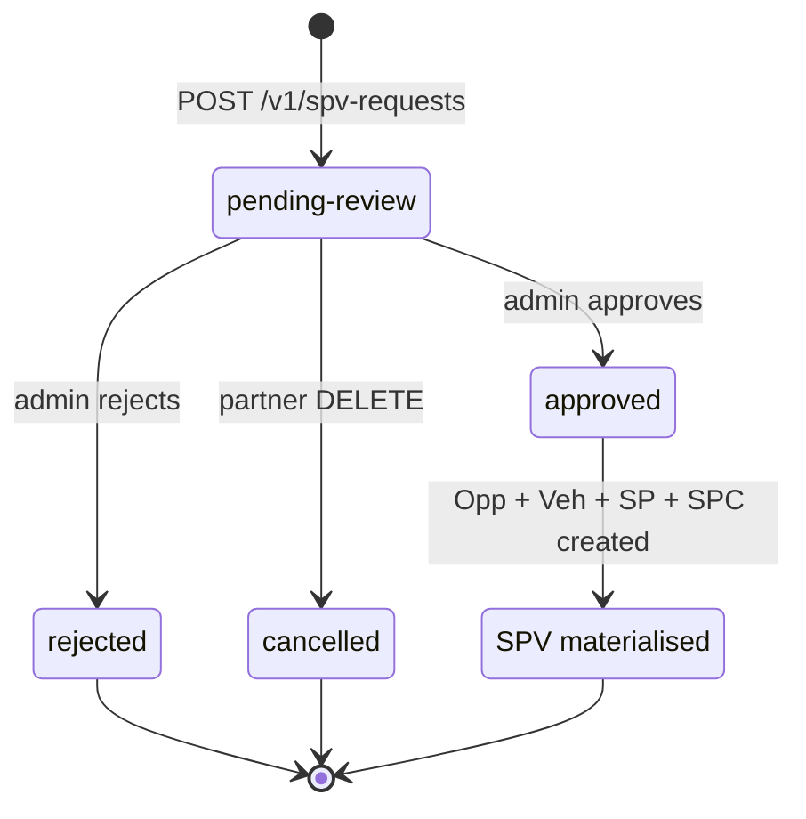

An **SPV request** is a partner-submitted intent to spin up a new Special Purpose Vehicle on the Zest platform. Zest admins review every request; on approval the SPV is materialised — i.e. an Opportunity, Vehicle, SP, and SPC are all created and committed in one transaction.

## Lifecycle



| State | Description | Webhook |
| ----- | ----------- | ------- |
| `pending-review` | Awaiting Zest admin review. | [`spv_request.created`](/webhooks/events/spv-request-created) |
| `approved` | Admin approved. SPV has been materialised. | [`spv_request.completed`](/webhooks/events/spv-request-completed) |
| `rejected` | Admin rejected. Terminal. Submit a new request to retry. | [`spv_request.rejected`](/webhooks/events/spv-request-rejected) |
| `cancelled` | Partner cancelled while still pending. Terminal. | [`spv_request.cancelled`](/webhooks/events/spv-request-cancelled) |

## What partners see

- `POST /v1/spv-requests` — create a request. Returns `201 Created` with the full request shape and `status: pending-review`.
- `GET /v1/spv-requests/{slug}` — read a single request.
- `GET /v1/spv-requests` — paginated listing, optionally filtered by `status`.
- `DELETE /v1/spv-requests/{slug}` — cancel a `pending-review` request. Returns `409 conflict` if the request is in any terminal state.

The four partner-visible states above are stable; Zest never emits intermediate or internal states on the wire.

## Correlation patterns

Slugs Zest server-generates (`opportunitySlug`, `vehicleSlug`, `spSlug`, `subscriptionSlug`) are opaque UUID v7 strings. **Don't parse them** — they have no internal structure. `spcSlug` is partner-supplied (echoed back from the admin's approve request) and may use whatever format the SPC was originally registered with.

Two ways to correlate Zest responses back to your own system:

### Via your `deal_slug` (partner correlation key)

When you submit `POST /v1/spv-requests`, you include `attributes.deal_slug` — a free-form string you control. Zest never uses this value as the canonical opportunity identifier; it's stored separately and echoed back in:

- The `attributes.deal_slug` field of every SPV-request response.
- The `attributes.deal_slug` field of every SPV-request webhook payload (`spv_request.created`, `spv_request.completed`, `spv_request.rejected`, `spv_request.cancelled`).

`deal_slug` does **not** need to be globally unique — two partners may submit identical values without conflict. Whether `deal_slug` is unique within your tenant is your bookkeeping concern.

### Via `spvRequestSlug` (Zest's submit-time identifier)

When `POST /v1/spv-requests` succeeds, Zest returns an `spvRequestSlug` — a stable identifier for the SPV-request lifecycle. Use it as your join key if you'd rather not propagate your `deal_slug` through your data model.

Example `materialisedRefs` payload (returned on `spv_request.completed`):

```json
"materialisedRefs": {
  "opportunitySlug": "06a04437-a7c7-7a57-8000-2c45ded5ab3f",
  "vehicleSlug":     "06a04437-b332-7891-8000-71f4c9b821ee",
  "spSlug":          "06a04437-c891-7012-8000-f3b8c4d1a772",
  "spcSlug":         "monark-spc-01"
}
```

## Validation

When you `POST /v1/spv-requests`, the `attributes` map is validated against the contract template referenced by `templateId` + `templateVersion`. A failure returns `400 validation_error` with one or more `validationErrors[]` rows; see [Errors](/errors) for the full code vocabulary.

Every contract template is read-only and versioned; `GET /v1/contracts/templates/{version}` lists them. Current available version: **`1.0.0`**.

Your `templateId` is assigned by Zest during onboarding — see [Contract templates](#contract-templates) below.

## Contract templates

A **contract template** is the schema that validates the `attributes` map you send when you `POST /v1/spv-requests`. Each template encodes a specific deal structure — which fields are required, the allowed value ranges, the allowed share-class shapes — and is versioned independently from your integration.

Your `templateId` is assigned by Zest during partner onboarding. The value is specific to your integration: each partner is provisioned with the template that matches the deal structures we agreed on during commercial scoping, and that pairing is not self-service. You will receive your `templateId` alongside your `clientId` and webhook signing secret — use it verbatim everywhere `<your_template_id>` appears in this documentation.

If your integration needs to support a deal structure outside the template you were assigned, contact `sara@zestholdco.com` so we can scope a template update or a new template version.

## Idempotency

`Idempotency-Key` is **required** on `POST /v1/spv-requests`. Generate a UUIDv4 per logical click; replay the same key after a network failure to safely reuse the original response. See [Idempotency](/idempotency).

