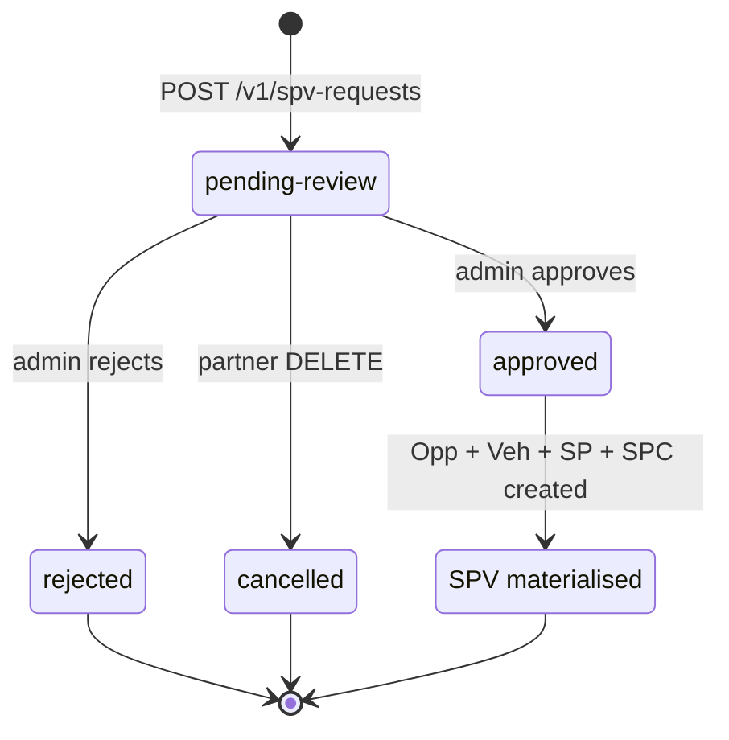

An **SPV request** is a partner-submitted intent to spin up a new Special Purpose Vehicle on the Zest platform. Zest admins review every request; on approval the SPV is materialised — i.e. an Opportunity, Vehicle, SP, and SPC are all created and committed in one transaction.

## Lifecycle

| State | Description | Webhook |
| ----- | ----------- | ------- |
| `pending-review` | Awaiting Zest admin review. | [`spv_request.created`](/webhooks/events/spv-request-created) |
| `approved` | Admin approved. SPV has been materialised. | [`spv_request.completed`](/webhooks/events/spv-request-completed) |
| `rejected` | Admin rejected. Terminal. Submit a new request to retry. | [`spv_request.rejected`](/webhooks/events/spv-request-rejected) |
| `cancelled` | Partner cancelled while still pending. Terminal. | [`spv_request.cancelled`](/webhooks/events/spv-request-cancelled) |

## What partners see

- `POST /v1/spv-requests` — create a request. Returns `201 Created` with the full request shape and `status: pending-review`.
- `GET /v1/spv-requests/{slug}` — read a single request.
- `GET /v1/spv-requests` — paginated listing, optionally filtered by `status`.
- `DELETE /v1/spv-requests/{slug}` — cancel a `pending-review` request. Returns `409 conflict` if the request is in any terminal state.

The four partner-visible states above are stable; Zest never emits intermediate or internal states on the wire.

## Validation

When you `POST /v1/spv-requests`, the `attributes` map is validated against the contract template referenced by `templateId` + `templateVersion`. A failure returns `400 validation_error` with one or more `validationErrors[]` rows; see [Errors](/errors) for the full code vocabulary.

Every contract template is read-only and versioned; `GET /v1/contracts/templates/{version}` lists them. Current available version: **`1.0.0`**.

Your `templateId` is assigned by Zest during partner onboarding.

## Idempotency

`Idempotency-Key` is **required** on `POST /v1/spv-requests`. Generate a UUIDv4 per logical click; replay the same key after a network failure to safely reuse the original response. See [Idempotency](/idempotency).

