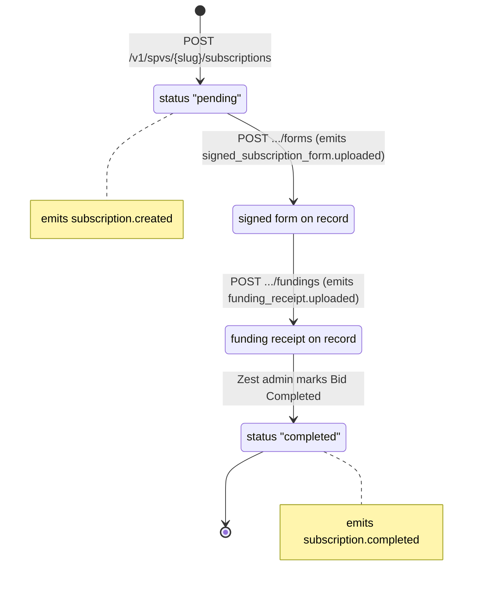

A **subscription** is a single investor's commitment to deploy capital into a single SPV at a specified share class. Partners create subscriptions in bulk per SPV via `POST /v1/spvs/{slug}/subscriptions`.

## Lifecycle

## `subscription.completed` delivery

`subscription.completed` is **eventually consistent**:

1. When a Zest admin marks the subscription `Completed`, the system attempts to emit `subscription.completed` synchronously.
2. If that synchronous emit was skipped (admin path bypassed the helper, queue back-pressure, transient error), a reconciler runs on a 60-second cadence and emits the webhook for any subscription that hasn't yet received its `subscription.completed`.

Practical implications for partners:

- You **will** receive exactly one `subscription.completed` per subscription, even if the synchronous path drops it.
- The webhook may arrive up to ~60 seconds after the admin action, not instantly.
- Idempotency is enforced via the flag — the reconciler never double-fires.

## Strict order: forms before fundings

`POST .../fundings` returns **`409 conflict`** when called before `POST .../forms` succeeds. This enforces compliance: Zest must hold the signed subscription contract before any wire-transfer money is associated with the subscription.

If you orchestrate uploads in parallel, gate the funding upload on a successful signed-form response (or on the corresponding webhook).

## Per-row payload

Each row in the bulk request carries:

| Field | Required | Notes |
| ----- | -------- | ----- |
| `partnerSubscriptionId` | optional | Echoed in the response and on every downstream webhook for correlation. |
| `zestPersonId` | required | Returned from `POST /v1/investors`. |
| `lumpSum` | required | `{ "currency": "USD", "value": "50000.00" }`. Currency is ISO 4217. |
| `shareClassSlug` | required | Slug of the share class on the SPV. |

The `lumpSum.value` is a decimal string — never a float — to avoid binary floating-point drift on monetary amounts.

## Idempotency

`Idempotency-Key` is **optional** on `POST /v1/spvs/{slug}/subscriptions`. Replays under the same key + same body return the cached response (24h TTL). See [Idempotency](/idempotency).

## Upload constraints

Both `forms` and `fundings` endpoints accept multipart uploads with:

- Max size: **10 MB**.
- Allowed content types: `application/pdf`, `image/jpeg`, `image/png`, `image/webp`.

Oversize → `413 payload_too_large`. Wrong content-type → `415 unsupported_media_type`.
